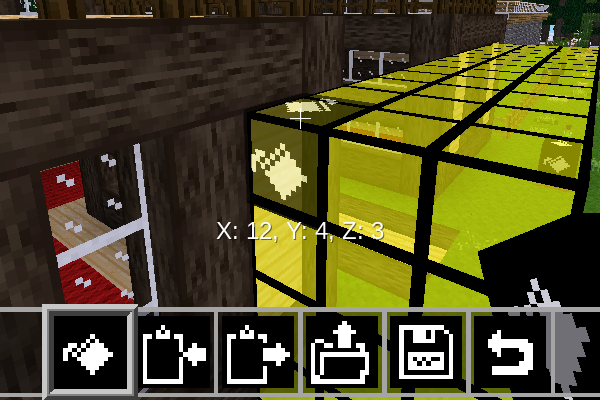
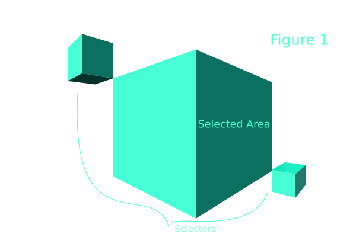
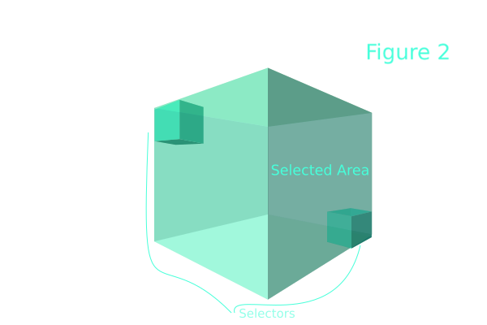

minetest mod Edit
==================

This mod provides a block way to cut, paste, fill or delete regions

Information
-----------

This mod is named `edit`, permits to a player, manage regions by the usage 
of blocks to mark ones. It provides functionalities of `cut`, `copy`, `paste` and `delete`, 
but using always special blocks to mark the dessired area.

Technical information
---------------------

This source provides mod named `edit`, a block way to cut, paste, fill 
or delete regions by the usage of special blocks.

| Block       | internal name | item             |
| ----------- | ---------- | ------------------- |
| Copy block  | edit:copy  |   |
| Paste block | edit:paste |  |
| Fill block  | edit:fill  |   |
| Delete block | edit:delete |   |

##### dependences

none

Usage
------

The usage is by the mark of areas beetween two blocks, player must have the special blocks, 
must mark an area using two paired blocks of the same type, later can operate that area:

#### Copy Block and Paste Block

When two Copy Blocks are placed they select an area between them as show
in figure 1. When an area is surrounded it is copied and the two Copy
Blocks are deleted.

The Paste Block is used for pasting a 3D area copied by the Copy Block.
When a Paste Block is placed the copied area is pasted relative to the
position of the first placed Copy Block when it was copied.

###### Delete Block

Delete Blocks are used to delete a 3D area. When two Delete Blocks are
placed they select an area between them as show in figure 1. When an area
is surrounded it is deleted and the two Delete Blocks are deleted as well.

#### Fill Block

Fill Blocks are used to fill a 3D area with a certain block. You can do so
by first selecting an area by surrounding it with two fill blocks. Fill
Blocks work differently when surrounding an area in that the area selected
includes the position of the Fill Blocks themselves as show in figure 2.

Once an area is surrounded a dialog pops up and shows you all the blocks
in your inventory. If you press one, the selected area will be filled with
the block pressed. If you press a blank slot the selected area will be
filled with air. To cancel, press the "X".

LICENCE
-------

CC0 by MrRar check [LICENSE](LICENSE) file, this mod was started by MrRar, 
minetest-mods community later absorved but abandoned.

