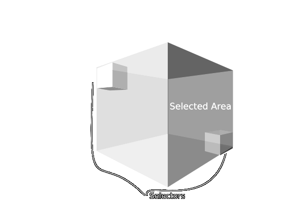

# Minetest Edit Mod

## Overview

This mod named `edit` allows copying, pasting, filling, deleting, opening and saving 3D areas.
Schematics are loaded and saved from .mts files located in the world sub folder `schems`.

This mod was inspired by the Fill Start and Fill End blocks in Manic Digger.

## Items

| Name   | Item ID     | Image                         |
| ------ | ----------- | ----------------------------- |
| Copy   | edit:copy   |    |
| Paste  | edit:paste  |   |
| Fill   | edit:fill   |    |
| Open   | edit:open   |    |
| Save   | edit:save   |    |
| Undo   | edit:undo   |    |

## Dependencies

None

## Usage

### Copy Tool

When the copy tool is placed at opposite corners of an area, they select the area as show in the figure. The copy tool uses the location under the placed position. When the copy tool is placed for the first time, a marker entity is placed. To cancel the copy operation, punch the entity marker. When a copy tool is placed a second time, the selected area is copied and the entity marker is removed.

### Paste Tool

The paste tool is used for pasting the area copied by the copy tool or a schematic loaded with the open tool. When a paste tool is placed, the copied area or schematic is placed at the corner of the paste tool. The copied area can be rotated by punching while holding the paste tool.

### Fill Node

Fill nodes are used to fill a 3D area with a certain item. Start by placing two fill nodes at opposite corners of the desired area. The selected area includes the positions of the fill nodes themselves as shown in the figure.

Once a second fill node is placed, a dialog appears listing all items in the players inventory. Clicking an item will cause it to be used used for filling the selected area. Clicking on a blank slot will cause the selected area to be filled with air. To cancel the fill, press the "X".

### Open Tool

Right click with this tool to load a .mts schematic for pasting from the the world subfolder `schems`.

### Save Tool

Right click with this tool to save copied area as a .mts schematic in the the world subfolder `schems`.

### Undo Tool

Right click with this tool to undo a world modification like filling or pasting.
Use a second time to redo the undo.
Only the most resent world modification can be undone.

## Settings

### edit_paste_preview_max_entities

If the copied area has a larger number of nodes, some nodes will be randomly excluded from the preview.

### edit_max_operation_volume

The maximum volume of any edit operation. Increase to allow larger operations.

### edit_use_fast_node_fill

Fast filling of nodes. This uses VoxelManip for fast node placement.
No node placement callbacks are called so some nodes might be broken.

## Privileges

Edit tools and nodes can only be used by players with `edit` privilege.

## License

CC0 by MrRar check [License](LICENSE) file, this mod was started by MrRar, 
minetest-mods community.

