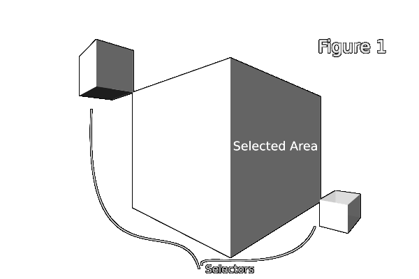
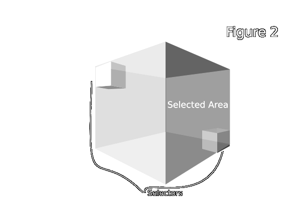

# Minetest Edit Mod

## Overview

This mod named `edit` allows copying, pasting, filling, deleting, opening and saving 3D areas.
Schematics are loaded and saved from .mts files located in the world subfolder `schems`.

This mod was inspired by the Fill Start and Fill End blocks in Manic Digger.

## Items

| Name   | Node ID     | Image                         |
| ------ | ----------- | ----------------------------- |
| Copy   | edit:copy   |    |
| Paste  | edit:paste  |   |
| Fill   | edit:fill   |    |
| Delete | edit:delete |  |
| Open   | edit:open   |    |
| Save   | edit:save   |    |
| Undo   | edit:undo   |    |

## Dependencies

None

## Usage

### Copy Node

When two copy nodes are placed at opposite corners of an area, they select the area as show in figure 1. When an area is selected, it is copied and the two copy nodes are deleted.

### Paste Node

The paste node is used for pasting the area copied by the copy node or a schematic loaded with the open node. When a paste node is placed, the copied area or schematic is placed at the corner of the paste node. In the case of a copied area, area is pasted relative to the position of the first placed copy node when it was copied. The copied area can be rotated when the paste preview is visible by pressing the sneak key and an arrow key.

### Delete Node

Delete nodes are used to delete a 3D area. When two delete nodes are placed at opposite corners of an area, they select the area as show in figure 1. When an area is selected, it is deleted and the two delete nodes are removed as well.

### Fill Node

Fill nodes are used to fill a 3D area with a certain item. Start by placing two fill nodes at opposite corners of the desired area. The selected area includes the positions of the fill nodes themselves as shown in figure 2.

Once a second fill node is placed, a dialog appears listing all items in the players inventory. Clicking an item will cause it to be used used for filling the selected area. Clicking on a blank slot will cause the selected area to be filled with air. To cancel the fill, press the "X".

### Open Tool

Right click with this tool to load a .mts schematic for pasting from the the world subfolder `schems`.

### Save Tool

Right click with this tool to save copied area as a .mts schematic in the the world subfolder `schems`.

### Undo Tool

Right click with this tool to undo a world modification like filling or pasting.
Use a second time to redo the undo.
Only the most resent world modification can be undone.

## Settings

### edit_paste_preview_max_entities

If the copied area has a larger number of nodes, some nodes will be randomly excluded from the preview.

### edit_max_operation_volume

The maximum volume of any edit operation. Increase to allow larger operations.

### edit_use_fast_node_fill

Fast filling of nodes. This uses VoxelManip for fast node placement.
No node placement callbacks are called so some nodes might be broken.

## Privileges

Edit tools and nodes can only be used by players with `edit` privilege.

## License

CC0 by MrRar check [License](LICENSE) file, this mod was started by MrRar, 
minetest-mods community.

